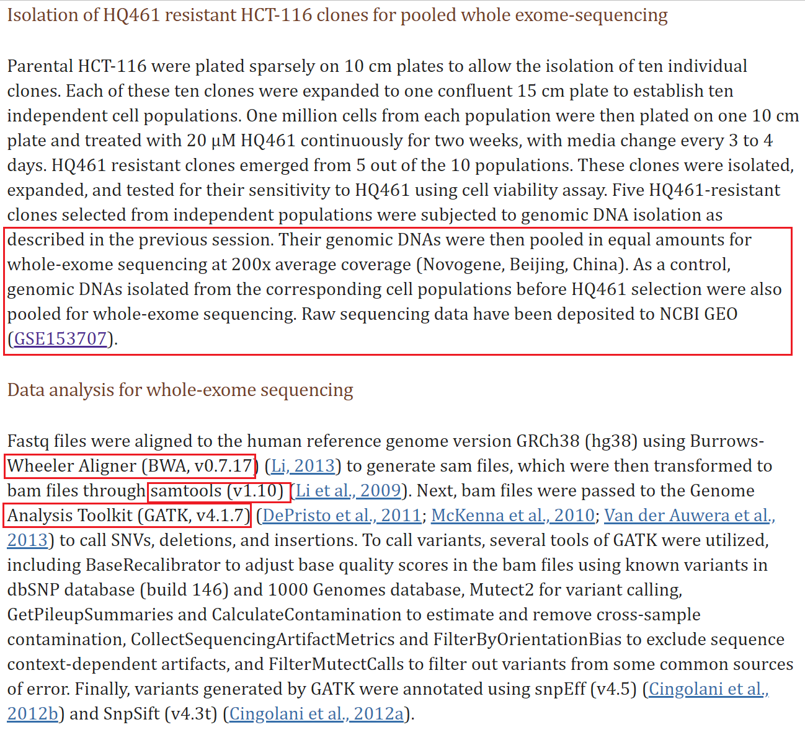

# whole_exome_sequencing_pipeline
### Record of whole exome sequencing analysis study
In this study, I will try to repeat the results in "[Discovery of a molecular glue promoting CDK12-DDB1 interaction to trigger cyclin K degradation](https://www.ncbi.nlm.nih.gov/pmc/articles/PMC7462607/)". The datasets are from [GSE153707](https://www.ncbi.nlm.nih.gov/geo/query/acc.cgi?acc=GSE153707).

- Download the 'Accession List' from the [SRA Run Selector](https://www.ncbi.nlm.nih.gov/Traces/study/?acc=PRJNA643782).

#### Acknowledgements:

[Biotrainee](https://www.yuque.com/biotrainee/wes)

[生信技能树](https://mp.weixin.qq.com/s?__biz=MzAxMDkxODM1Ng%3D%3D&mid=2247507808&idx=2&sn=f3572ffe23d3b75c8364cb890312b19b&scene=45#wechat_redirect)